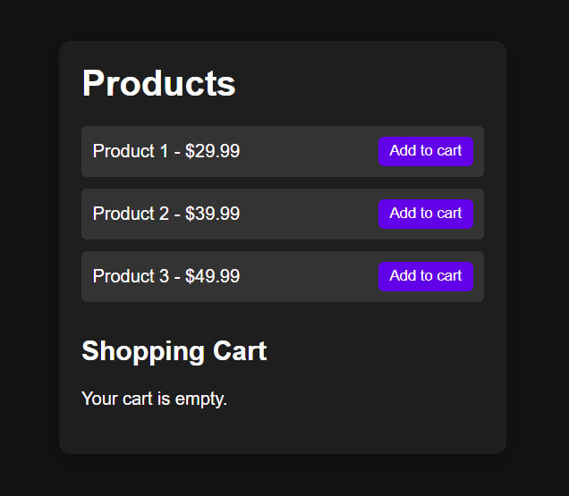
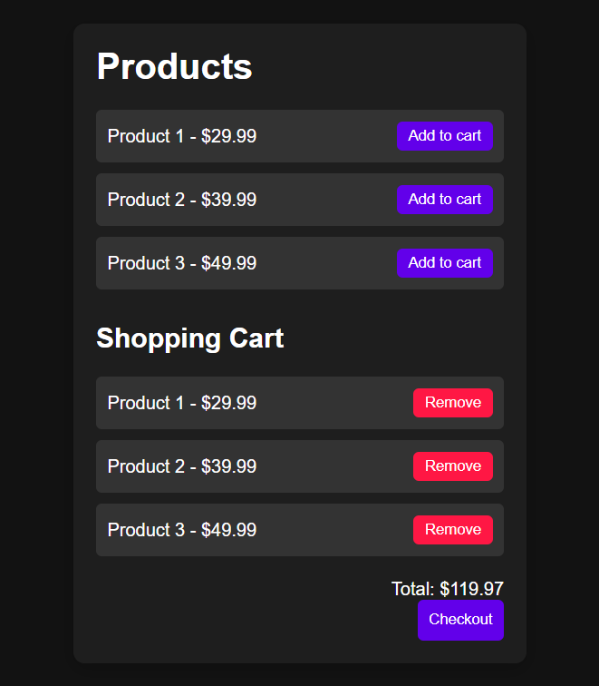
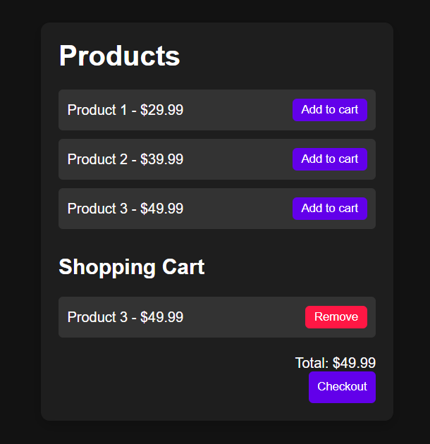

# SwiftCart: Efficient Shopping Cart Management

SwiftCart is a simple and efficient shopping cart management application. It allows users to add products to their cart, view the cart items, and remove items from the cart.

## Features

- **Dynamic Product Listing**: The application dynamically generates product listings from a predefined array of product objects, each containing an ID, name, and price.
- **Add to Cart Functionality**: Users can add products to their cart by clicking the "Add to Cart" button. This action triggers a function that updates the cart array.
- **Cart Display Update**: The application updates the cart display in real-time, showing the list of items in the cart, their prices, and the total price. This is achieved through DOM manipulation.
- **Remove from Cart Functionality**: Users can remove items from their cart by clicking the "Remove" button next to each item. This action updates the cart array and total price.
- **Responsive UI**: The user interface is designed to be responsive, providing a seamless experience across different devices and screen sizes.

## Demo

Here are some screenshots of the SwiftCart application:

## File Structure

### index.html

The main HTML file that contains the structure of the application. It includes the product list, cart items, and total price.

### style.css

The CSS file that contains the styles for the application. It includes styles for the body, container, product items, cart items, and buttons.

### script.js

The JavaScript file that contains the logic for the application. It includes functions for adding items to the cart, removing items from the cart, and updating the cart display.
