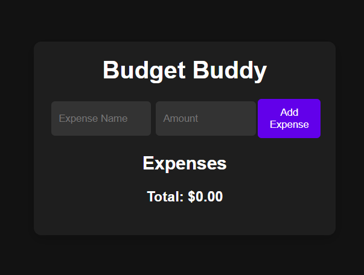
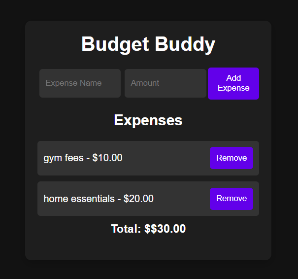
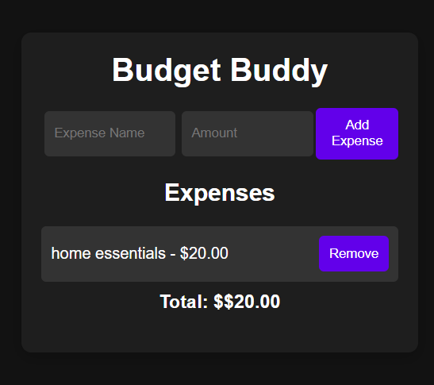

# BudgetBuddy: Your Personal Expense Tracker

BudgetBuddy is a simple and efficient expense tracking application. It allows users to add, view, and manage their expenses. The expenses are stored in the browser's local storage, so they persist even after the page is refreshed.

## Features

- **Add Expenses**: Users can add expenses by entering the expense name and amount.
- **View Expenses**: Users can view a list of all their expenses, including the name, amount.
- **Delete Expenses**: Users can delete individual expenses from the list.
- **Persistent Storage**: Expenses are saved in the browser's local storage, ensuring that the data is preserved across page reloads.
- **Total Expense Calculation**: The application calculates and displays the total amount of expenses.
- **Responsive Design**: The user interface is designed to be responsive, providing a seamless experience across different devices and screen sizes.

## Demo

Here are some screenshots of the BudgetBuddy application:

## File Structure

### index.html

The main HTML file that contains the structure of the application. It includes the form for adding expenses and the list of expenses.

### style.css

The CSS file that contains the styles for the application. It includes styles for the body, container, form, expense list, and buttons.

### script.js

The JavaScript file that contains the logic for the application. It includes functions for adding expenses, deleting expenses, saving and loading expenses from local storage, and updating the expense list display.
