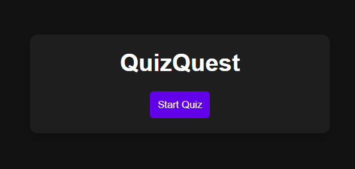
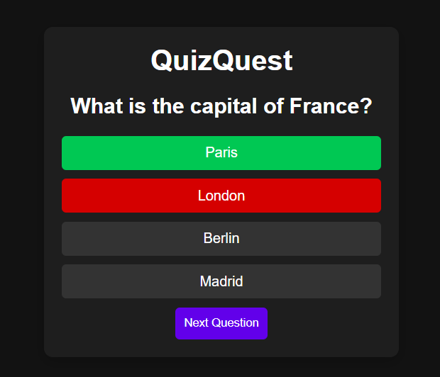
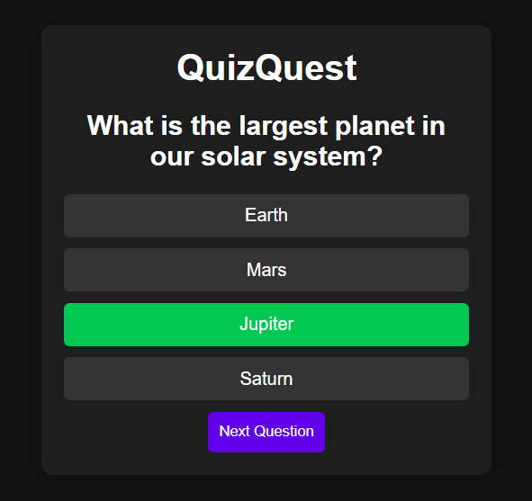
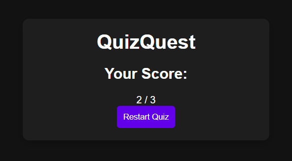

# QuizQuest

QuizQuest is a simple web-based quiz application that allows users to test their knowledge on various topics. The application presents multiple-choice questions and provides immediate feedback on the user's answers. At the end of the quiz, the user's score is displayed.

## Features

- **Start Quiz**: Begin the quiz by clicking the "Start" button.
- **Multiple-Choice Questions**: Each question has multiple options to choose from.
- **Immediate Feedback**: Once an option is selected, the correct and incorrect answers are highlighted.
- **Next Question**: Proceed to the next question by clicking the "Next" button.
- **Restart Quiz**: Restart the quiz at any time by clicking the "Restart" button.
- **Score Display**: At the end of the quiz, the user's score is displayed.

## Demo

Here are some screenshots of the QuizQuest application:

## Technologies Used

- **HTML**: Structure of the web page.
- **CSS**: Styling of the web page, including layout, colors, and transitions.
- **JavaScript**: Interactivity and logic of the quiz application.

## Learning Objectives

### HTML

- **Semantic Elements**: Use of semantic HTML elements for better accessibility and SEO.
- **DOM Manipulation**: Understanding how to interact with and manipulate the Document Object Model (DOM).

### CSS

- **Flexbox**: Use of Flexbox for layout and alignment.
- **Transitions**: Adding smooth transitions for hover effects and state changes.
- **Responsive Design**: Ensuring the application looks good on different screen sizes.

### JavaScript

- **Event Handling**: Adding event listeners to handle user interactions.
- **Functions**: Creating reusable functions to manage quiz logic.
- **Conditional Statements**: Using if-else statements to check answers and update the score.
- **Loops**: Iterating over arrays to display questions and choices.
- **DOM Manipulation**: Dynamically updating the DOM based on user actions.

## How to Run

1. Clone the repository to your local machine.
2. Open `index.html` in your web browser.
3. Click the "Start" button to begin the quiz.

## Future Enhancements

- **Add More Questions**: Expand the quiz with more questions and categories.
- **Timer**: Implement a timer for each question to increase difficulty.
- **Score History**: Save and display the user's score history.
- **Mobile Optimization**: Further optimize the application for mobile devices.
